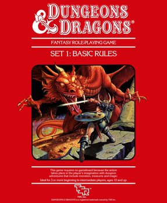

Hello, my name is Thomas Due, and I am a software developer, gamer, roleplayer and dad. 

## Software Development
Since my first computer, a Commodore 64, back in the mid-1980s, 
I have had an interest for software development. In the beginning it was whatever code I could find in
a magazine that had to be typed in by hand. But slowly that shifted to my own projects. 

This culminated with an assembler I painstakenly typed in from an english C64 magazine. By the time high-school
came around, I was writing "demos" in assembler on my C64, "to demonstrate how cool I was".

After high-school I went to college to study Computer Science, and after a couple of false starts 
and generally messing around, I graduated in 2000 with an *Academy Profession Degree in Computer Science*. 

I have been doing it ever since. 

## Gaming

Back in the day, the primary purpose of a C64, was without a doubt, playing computer games, and to be 
honest, I never stopped. 

My primary genres are strategy games, roleplaying games, sandbox survival games and the likes. I don't
particularly get a kick from first-person shooters, probably because I suck at it ;)

## Roleplaying Games
Table-top to be exact. I started with the famous Dungeons & Dragons Red Box. 

.

I am Thomas Due, I have been developing software since my first Commodore 64, almost 40 years ago.

These days, I am using .net and c#. 

This is my personal website, built from scratch with asp.net core razor. It is primarily intended 
    to be used as a blog, but will serve as a show-case of, well, me.

